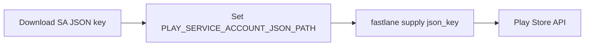
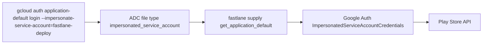
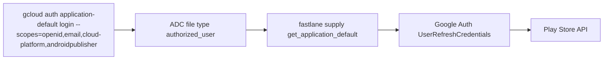

# ADR 008: Play Store upload auth via GCP CLI Application Default Credentials

## Context

The release pipeline (`scripts/release.sh` → `fastlane release`) signs the AAB with a keystore fetched from Dashlane and uploads it to the Play Store. For a long time, Play Store upload auth relied on a downloaded service account JSON file passed via `PLAY_SERVICE_ACCOUNT_JSON_PATH`. That file had to be generated, downloaded, and persisted on disk — a credential sprawl we wanted to eliminate.

We evaluated three ways to authenticate `fastlane supply` against the Play Store:

1. **Service account JSON key** (status quo, classic fastlane approach).
2. **GCP CLI ADC with service account impersonation** (`gcloud auth application-default login --impersonate-service-account=...`).
3. **GCP CLI ADC with the developer's personal account** (`gcloud auth application-default login`).

Each was implemented and tested. The decision documented here is the approach ultimately kept.

## Approaches compared

### 1. Service account JSON key



- Requires downloading and storing a long-lived key file.
- Natively supported by every fastlane version (type `service_account`).
- **Not recommended by Google** — long-lived service account keys are discouraged in favour of impersonation / Workload Identity Federation.

### 2. GCP CLI ADC + service account impersonation



- No persisted key: credentials derived at runtime from the impersonating user.
- Releasing as a dedicated service account decouples auth from humans.
- **Two blockers found during implementation:**
  - fastlane 2.228's `supply` hard-codes `ServiceAccountCredentials` and has no ADC discovery; only fastlane ≥ 2.240 has it.
  - googleauth ≥ 1.16 makes `fetch_access_token!` private, yet fastlane 2.240.1 calls it directly on `ImpersonatedServiceAccountCredentials` → `NoMethodError`.
  - Required a **monkeypatch** in the Fastfile to re-expose the method, plus a manual IAM grant (`roles/iam.serviceAccountTokenCreator`).
  - **No googleauth version supports `impersonated_service_account` with a public `fetch_access_token!`**, so pinning could not resolve it.

### 3. GCP CLI ADC + developer's personal account (chosen)



- No persisted key: credentials live in `~/.config/gcloud/application_default_credentials.json`.
- Native fastlane support (type `authorized_user`) — works in fastlane 2.228 and 2.240, **no monkeypatch required**.
- Requires the developer's account to have **Release** permission in Play Console (the developer is an admin with Release rights).

## Decision

Authenticate Play Store uploads with GCP CLI Application Default Credentials using the **developer's personal account**:

```bash
gcloud auth application-default login \
  --scopes=openid,email,https://www.googleapis.com/auth/cloud-platform,https://www.googleapis.com/auth/androidpublisher
```

`fastlane supply` is invoked without `json_key`; the Fastfile sets `package_name` and `skip_upload_apk: true` explicitly.

## Reasons

- **No service account JSON persisted on disk** — the key-file approach's main drawback is removed in both ADC variants; personal-account ADC keeps it with zero extra machinery.
- **No monkeypatch.** The impersonation path worked only after a fragile runtime patch to a private googleauth method. Personal-account ADC is natively supported by fastlane and needs none.
- **No manual IAM grant.** Impersonation required granting `roles/iam.serviceAccountTokenCreator` to the invoking user; the personal-account approach needs only Play Console permissions the developer already holds (admin + Release).
- **Rejected — service account JSON key:** Google explicitly discourages long-lived service account keys, recommending impersonation / Workload Identity Federation instead. Reintroduces the persisted credential file we set out to remove.
- **Rejected — impersonation + monkeypatch:** best for decoupling auth from individuals, but the fastlane/googleauth version matrix is brittle — the monkeypatch targets a private API that can move again at any googleauth release, and no version pin resolves it. The complexity outweighed the decoupling benefit for a solo-admin project.

## Consequences

- `scripts/release.sh` no longer requires `PLAY_SERVICE_ACCOUNT_JSON_PATH`; it only checks that an ADC file exists.
- The Fastfile must remain on fastlane ≥ 2.240 for ADC discovery, and must keep `package_name` + `skip_upload_apk`.
- Releasing now depends on the developer's personal Play Console role: **revisit if** the project grows multiple release engineers or a release bot is needed — then re-evaluate impersonation (once fastlane/googleauth fix the private method) or a key-rotation scheme around the service account.
- The ADC file must be refreshed with the `androidpublisher` scope; a plain `gcloud auth application-default login` without it fails at upload with `Request had insufficient authentication scopes`.