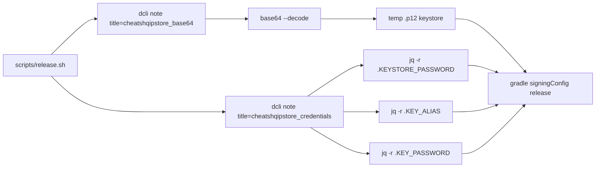

# ADR 009: Store signing credentials fetched from Dashlane CLI at release time

## Context

Releasing to the Play Store requires an Android signing keystore (`.p12`) plus its `KEYSTORE_PASSWORD`, `KEY_ALIAS`, and `KEY_PASSWORD`. These secrets used to be passed manually to `scripts/release.sh` as environment variables:

```bash
KEYSTORE_PATH=... KEYSTORE_PASSWORD=... KEY_ALIAS=... KEY_PASSWORD=... ./scripts/release.sh
```

This is error-prone (copy-pasting secrets, typos) and leaks credentials into shell history or terminal buffers. The signing keystore itself must never be committed to git, yet it is essential for every release — so it needs a safe, repeatable home.

## Decision

Store the signing material in Dashlane secure notes and fetch it with the Dashlane CLI (`dcli`) inside `scripts/release.sh` at release time. Two notes are used:

- `cheatshqipstore_base64` — the keystore file, base64-encoded.
- `cheatshqipstore_credentials` — a JSON object with `KEYSTORE_PASSWORD`, `KEY_ALIAS`, `KEY_PASSWORD`.



The script:

1. Accepts the four env vars as an **override** — if all are set, Dashlane is not consulted (keeps CI/local override paths working).
2. Otherwise fetches the base64 note, decodes it to a keystore in `mktemp -d`, and parses the JSON note with `jq`.
3. Exports `KEYSTORE_PATH`, `KEYSTORE_PASSWORD`, `KEY_ALIAS`, `KEY_PASSWORD` so Gradle's `signingConfigs.release` (which reads `System.getenv`) picks them up.
4. Deletes the temporary keystore via `trap cleanup EXIT`, so the decoded file never survives the run — success, failure, or interruption.

## Reasons

- **No keystore in git, no keystore on disk after release.** The only persistent copy lives in Dashlane, which is the team's password vault of record.
- **No secret in shell history or terminal buffers.** Values flow through command substitution, not command-line arguments or `read` prompts.
- **Dashlane CLI output is usable directly.** `dcli note title=<title>` prints the note content to stdout (base64 blob or JSON), so the script needs no extra parsing beyond `base64 --decode` and `jq`.
- **Rejected — env vars as the only mechanism.** Forces every releaser to manage the keystore and passwords manually; the point of the exercise was to centralise them.
- **Rejected — commit the keystore to the repo.** Losing the signing key is unrecoverable for Android releases; it must stay out of version control.
- **Rejected — a separate secrets-management backend (Vault, SOPS, etc.).** Adds infrastructure the project does not otherwise have; Dashlane is already used and its CLI supports non-interactive scripting.

## Consequences

- Releases require `dcli` installed and an unlocked Dashlane vault on the machine running `scripts/release.sh`.
- The `.p12` file exists only inside the temporary directory for the duration of the run and is removed on exit.
- The two Dashlane notes must be kept in sync with each other (the base64 blob and the passwords), and only those with Dashlane access can release — acceptable for a solo-admin project.
- Gradle's `signingConfigs.release` in `app/build.gradle.kts` reads the four env vars, so **no build change was needed**.
- **Revisit if:** multiple release engineers arrive or a CI release bot is added — then consider rotating to an infrastructure secret store (e.g. GitHub Actions secrets) for the keystore, keeping Dashlane as the human-facing vault.