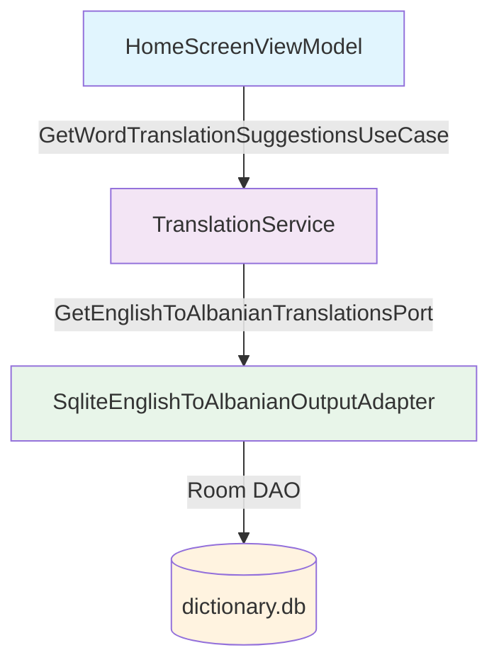
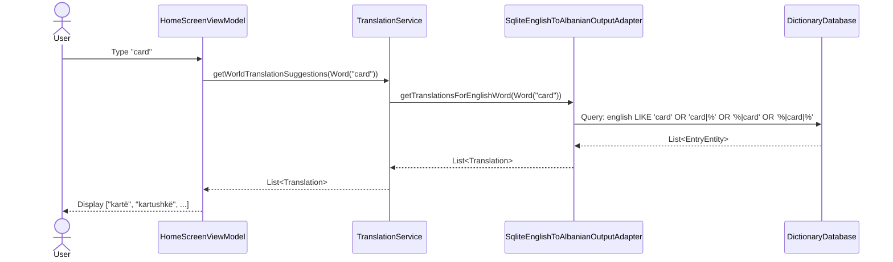

# Plan: Remove ML Kit, Use Bundled Dictionary DB as Sole Translation Source

## Feature
English→Albanian Translation via DB Lookup

## Acceptance Test
`given english word, should return albanian translations directly from DB`

---

## Architecture Overview

**Component Diagram**:


**Sequence Diagram**:


---

## Step-by-Step TDD Plan

---

### Phase 1: Create New Port and Adapter (DB-Direct Translation)

#### Step 1 — Create New Output Port for English→Albanian DB Lookup
```
[ Step 1 — Create GetEnglishToAlbanianTranslationsPort ]

  RED (acceptance)
    Write failing integration test: `given english word "card", should return albanian translations from DB`
    Use Room in-memory DB with test data
    Assert results contain Translation("kartë")

  RED (unit)
    Write failing unit test for new port interface: `given word, should return translations`
    Use fake implementation that throws UnsupportedOperationException

  GREEN
    Create port interface: `GetEnglishToAlbanianTranslationsPort` with method:
    `suspend fun getTranslationsForEnglishWord(englishWord: Word): List<Translation>`

  REFACTOR
    Verify port follows hexagonal conventions (no DB/Room imports)
```

#### Step 2 — Create SQL Query for English Token Matching
```
[ Step 2 — Implement SqliteEnglishToAlbanianOutputAdapter with LIKE query ]

  RED (acceptance)
    Extend integration test to verify exact token matching:
    - "card" matches entries where english contains "card" as standalone token
    - Does NOT match "discarded" or "cardboard" (substring rejection)

  RED (unit)
    Write failing unit test for adapter:
    `given DAO with test entries, should return translations for exact token matches`
    Create FakeDictionaryDao that returns hardcoded EntryEntity list

  GREEN
    Implement adapter with query from ADR:
    ```sql
    SELECT * FROM entry
    WHERE english = :word
       OR english LIKE :word||'|%'
       OR english LIKE '%|'||:word
       OR english LIKE '%|'||:word||'|%'
    LIMIT 20
    ```
    Map EntryEntity.albanianHeadword to Translation

  REFACTOR
    Extract query constants, add MAX_RESULTS limit
```

#### Step 3 — Add DAO Method for English Lookup
```
[ Step 3 — Extend DictionaryDao with English search method ]

  RED (acceptance)
    Integration test fails because DAO lacks method for English lookup

  RED (unit)
    Write failing test for new DAO method:
    `given DB with entries, should find entries by english token`

  GREEN
    Add to DictionaryDao:
    ```kotlin
    @RawQuery
    suspend fun searchByEnglishToken(query: SupportSQLiteQuery): List<EntryEntity>
    ```

  REFACTOR
    Verify query uses parameterized inputs to prevent SQL injection
```

---

### Phase 2: Update Service Layer
#### Step 4 — Refactor TranslationService with Single Port
```
[ Step 4 — Replace TranslationService to use new port ]

  RED (acceptance)
    Integration test for TranslationService fails with new single-port constructor

  RED (unit)
    Write failing unit test:
    `given english word, should delegate to new port and return translations`
    Use FakeEnglishToAlbanianOutputAdapter

  GREEN
    Create new TranslationService:
    ```kotlin
    class TranslationService(
        private val getEnglishToAlbanianTranslationsPort: GetEnglishToAlbanianTranslationsPort
    ) : GetWordTranslationSuggestionsUseCase {
        override suspend fun getWorldTranslationSuggestions(word: Word): List<Translation> {
            return getEnglishToAlbanianTranslationsPort
                .getTranslationsForEnglishWord(word.normalize())
                .take(MAX_NUMBER_OF_RESULTS)
        }
    }
    ```

  REFACTOR
    Remove old constructor with two ports
```

---

### Phase 3: DI Wiring

#### Step 5 — Update ApplicationModule for New Port
```
[ Step 5 — Wire new port in DI ]

  RED (acceptance)
    Integration test fails because Koin cannot inject new port

  RED (unit)
    Write failing test for DI module:
    `given koin context, should resolve new port to adapter`

  GREEN
    Update ApplicationModule:
    ```kotlin
    single<GetWordTranslationSuggestionsUseCase> {
        TranslationService(
            getEnglishToAlbanianTranslationsPort = get()
        )
    }
    single<GetEnglishToAlbanianTranslationsPort> {
        SqliteEnglishToAlbanianOutputAdapter(dao = get())
    }
    ```

  REFACTOR
    Remove old port bindings (GetAlbanianTranslationOfEnglishWordPort, GetWordSuggestionsPort)
```

---

### Phase 4: Remove ML Kit Dependencies

#### Step 6 — Remove ML Kit Adapter and Dependencies
```
[ Step 6 — Delete ML Kit related files ]

  RED (acceptance)
    All existing tests should still pass with new implementation

  GREEN
    Delete files:
    - MlKitTranslator.kt
    - FakeAlbanianTranslationOutputAdapter.kt (both test and mock)
    - Remove mlkit-translate from app/build.gradle.kts
    - Remove mlkitTranslateVersion from libs.versions.toml

  REFACTOR
    Update imports in all files that referenced deleted classes
```

#### Step 7 — Update Flavor-Specific DI Modules
```
[ Step 7 — Remove flavor-specific ML Kit modules ]

  RED (acceptance)
    Mock flavor tests should pass without FakeAlbanianTranslationOutputAdapter

  GREEN
    Delete:
    - app/src/prod/java/com/cheatshqip/CheatShqipApplication.kt (prodModule)
    - app/src/mock/java/com/cheatshqip/CheatShqipApplication.kt (mockModule)
    - app/src/mock/java/com/cheatshqip/FakeAlbanianTranslationOutputAdapter.kt
    
    Create unified CheatShqipApplication.kt in main/ that uses applicationModule only

  REFACTOR
    Verify all flavor-specific DI is consolidated
```

---

### Phase 5: Update Tests

#### Step 8 — Update Unit Tests to Use New Port
```
[ Step 8 — Rewrite GetWordTranslationSuggestionsUseCaseTest ]

  RED (acceptance)
    Existing unit tests fail with new TranslationService constructor

  RED (unit)
    Write failing tests for new service behavior:
    - `given english word, should return translations from new port`
    - `given english word, should normalize input`
    - `given english word, should limit results to 5`

  GREEN
    Update GetWordTranslationSuggestionsUseCaseTest:
    ```kotlin
    val useCase: GetWordTranslationSuggestionsUseCase =
        TranslationService(
            getEnglishToAlbanianTranslationsPort = FakeEnglishToAlbanianOutputAdapter()
        )
    ```
    Create FakeEnglishToAlbanianOutputAdapter that returns hardcoded translations

  REFACTOR
    Remove references to old ports
```

#### Step 9 — Update Integration Tests
```
[ Step 9 — Update REST integration test to use DB ]

  RED (acceptance)
    GetWordTranslationSuggestionsUseCaseRESTIntegrationTest fails

  GREEN
    Delete REST integration test (per ADR: REST path is dormant)
    OR update to test new DB path:
    ```kotlin
    // Replace REST adapter with new DB adapter in test module
    single<GetEnglishToAlbanianTranslationsPort> {
        SqliteEnglishToAlbanianOutputAdapter(dao = get())
    }
    ```

  REFACTOR
    Verify test exercises new DB lookup path
```

#### Step 10 — Create DB Integration Tests
```
[ Step 10 — Add integration tests for DB lookup ]

  RED (acceptance)
    No tests for actual DB queries with real dictionary.db asset

  RED (unit)
    Write failing test: `given real dictionary.db, should find translations for known english words`

  GREEN
    Create new integration test class:
    ```kotlin
    @Test
    fun `given real DB, card should return karte`() = runTest {
        val db = createDictionaryDatabase(InstrumentationRegistry.getInstrumentation().targetContext)
        val dao = db.dictionaryDao()
        val adapter = SqliteEnglishToAlbanianOutputAdapter(dao)
        
        val results = adapter.getTranslationsForEnglishWord(Word("card"))
        
        assertTrue(results.contains(Translation("kartë")))
    }
    ```

  REFACTOR
    Add tests for edge cases:
    - Empty results
    - Multiple token matches
    - Diacritic normalization
```

---

### Phase 6: Cleanup and Validation

#### Step 11 — Remove Unused Code
```
[ Step 11 — Delete obsolete files and code ]

  GREEN
    Delete:
    - GetAlbanianTranslationOfEnglishWordPort.kt
    - GetWordSuggestionsPort.kt
    - SqliteWordSuggestionsOutputAdapter.kt
    - RESTWordSuggestionsOutputAdapter.kt (dormant per ADR)
    
    Update:
    - Remove unused imports from all files

  REFACTOR
    Run lint and typecheck to ensure no broken references
```

#### Step 12 — Final Verification
```
[ Step 12 — Run full test suite and validate ]

  GREEN
    Run all tests:
    ```bash
    ./gradlew :app:testMockDebugUnitTest :app:testProdDebugUnitTest
    JAVA_HOME=~/.sdkman/candidates/java/21.0.7-zulu ./gradlew :app:detekt
    ```
    
    Verify:
    - All unit tests pass
    - All integration tests pass
    - Detekt reports no violations
    - Build succeeds

  REFACTOR
    Update AGENTS.md if any new test patterns or conventions were established
```

---

## File Changes Summary

| Action | File | Change |
|--------|------|--------|
| CREATE | `app/src/main/java/com/cheatshqip/application/port/output/GetEnglishToAlbanianTranslationsPort.kt` | New output port interface |
| CREATE | `app/src/main/java/com/cheatshqip/adapter/output/SqliteEnglishToAlbanianOutputAdapter.kt` | New DB adapter with LIKE query |
| MODIFY | `app/src/main/java/com/cheatshqip/adapter/output/DictionaryDao.kt` | Add `searchByEnglishToken` method |
| MODIFY | `app/src/main/java/com/cheatshqip/application/TranslationService.kt` | Replace with single-port implementation |
| MODIFY | `app/src/main/java/com/cheatshqip/di/ApplicationModule.kt` | Wire new port, remove old ports |
| DELETE | `app/src/main/java/com/cheatshqip/adapter/output/MlKitTranslator.kt` | Remove ML Kit adapter |
| DELETE | `app/src/main/java/com/cheatshqip/application/port/output/GetAlbanianTranslationOfEnglishWordPort.kt` | Remove old port |
| DELETE | `app/src/main/java/com/cheatshqip/application/port/output/GetWordSuggestionsPort.kt` | Remove old port |
| DELETE | `app/src/main/java/com/cheatshqip/adapter/output/SqliteWordSuggestionsOutputAdapter.kt` | Remove old adapter |
| DELETE | `app/src/test/java/com/cheatshqip/FakeAlbanianTranslationOutputAdapter.kt` | Remove test fake |
| DELETE | `app/src/mock/java/com/cheatshqip/FakeAlbanianTranslationOutputAdapter.kt` | Remove mock fake |
| DELETE | `app/src/prod/java/com/cheatshqip/CheatShqipApplication.kt` | Consolidate to main |
| DELETE | `app/src/mock/java/com/cheatshqip/CheatShqipApplication.kt` | Consolidate to main |
| MODIFY | `app/build.gradle.kts` | Remove mlkit-translate dependency |
| MODIFY | `gradle/libs.versions.toml` | Remove mlkitTranslateVersion |
| MODIFY | `app/src/test/java/com/cheatshqip/GetWordTranslationSuggestionsUseCaseTest.kt` | Update to use new port |
| DELETE | `app/src/test/java/com/cheatshqip/integration/GetWordTranslationSuggestionsUseCaseRESTIntegrationTest.kt` | Remove or update |
| CREATE | `app/src/test/java/com/cheatshqip/integration/SqliteEnglishToAlbanianOutputAdapterIntegrationTest.kt` | New DB integration tests |
| CREATE | `app/src/test/java/com/cheatshqip/FakeEnglishToAlbanianOutputAdapter.kt` | New test fake |
| CREATE | `app/src/main/java/com/cheatshqip/CheatShqipApplication.kt` | Unified application class |

---

## Test Coverage Requirements

- [ ] Unit tests for new port interface
- [ ] Unit tests for new adapter with fake DAO
- [ ] Unit tests for updated TranslationService
- [ ] Integration tests with real Room DB
- [ ] Edge case tests (empty, normalization, limits)
- [ ] All existing tests updated and passing
- [ ] 100% branch coverage for new code

---

## Known Limitations (from ADR)

- Results are unranked (table order, no bm25)
- Common words may return archaic/dialectal entries first
- Future: Add English FTS5 index for ranking (separate ADR)
