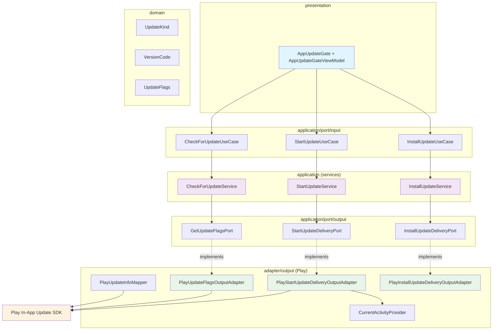
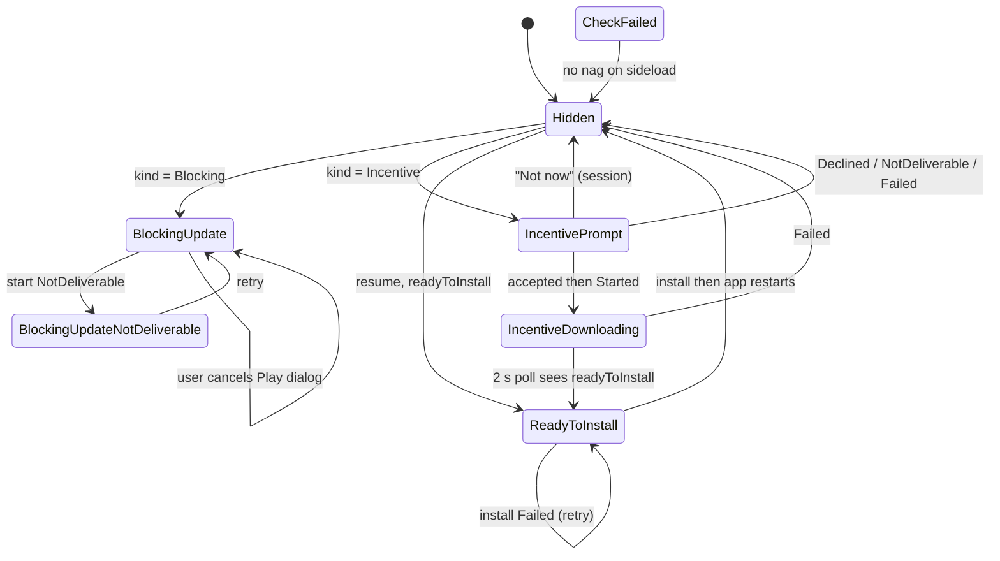
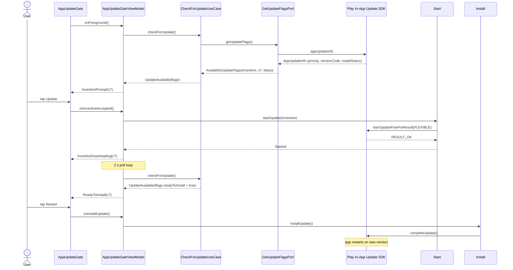

# Plan: In-App Updates (Blocking + Incentive) Behind Swappable Ports

## Feature
In-App Update Delivery via Play In-App Update SDK

## Acceptance Test
`given an available blocking update, should gate the app until updated`

`given an available incentive update, should prompt dismissibly and offer restart when downloaded`

---

## Decisions

| Decision | Choice |
|---|---|
| Update flags source | Play `AppUpdateInfo` only (`com.google.android.play:app-update:2.1.0` + `app-update-ktx`) |
| Blocking update | Play **immediate** update: full-screen gate, app unusable until updated |
| Incentive update | Play **flexible** update: dismissible soft prompt, background download, restart snackbar when ready |
| Kind decision | Play Console in-app update priority (0-5) mapped to `UpdateKind` **in the output adapter** (Play priority is a provider implementation detail; domain speaks only `Blocking`/`Incentive`) |
| Layout | Feature package `com.cheatshqip.appupdate.{domain, application, adapter, presentation, di}` |
| Provider swap | All Play specifics behind single-method output ports; switching providers = replace 3 adapters + DI bindings |

---

## Architecture Overview

**Component Diagram**:


**Gate State Machine**:


**Sequence Diagram (incentive flow)**:


**Invariants**: domain has zero provider concepts. One method per port. Services depend only on ports. ViewModel depends only on input ports. DI binds interfaces. `Activity`/Play types never cross a port boundary. Expected provider failures are result variants, never exceptions.

---

## Contracts

### Domain — `app/src/main/java/com/cheatshqip/appupdate/domain/`

```kotlin
// UpdateKind.kt
enum class UpdateKind { Blocking, Incentive }

// VersionCode.kt
@JvmInline
value class VersionCode(val value: Int)

// UpdateFlags.kt
data class UpdateFlags(
    val kind: UpdateKind,
    val availableVersionCode: VersionCode,
    val readyToInstall: Boolean,
)
```

### Output Ports — `appupdate/application/port/output/` (result sealed beside each port)

| Port | Method | Result |
|---|---|---|
| `GetUpdateFlagsPort` | `suspend fun getUpdateFlags()` | `Available(flags)`, `NotAvailable`, `Failed` |
| `StartUpdateDeliveryPort` | `suspend fun startUpdateDelivery(kind: UpdateKind)` | `Started`, `Declined`, `NotDeliverable`, `Failed` |
| `InstallUpdateDeliveryPort` | `suspend fun installUpdateDelivery()` | `Started`, `Failed` |

### Input Ports — `appupdate/application/port/input/`

| Use case | Method | Result |
|---|---|---|
| `CheckForUpdateUseCase` | `suspend fun checkForUpdate()` | `UpdateAvailable(flags)`, `NoUpdate`, `CheckFailed` |
| `StartUpdateUseCase` | `suspend fun startUpdate(kind: UpdateKind)` | `Started`, `Declined`, `NotDeliverable`, `Failed` |
| `InstallUpdateUseCase` | `suspend fun installUpdate()` | `Installing`, `Failed` |

### Application Services — `appupdate/application/`

`CheckForUpdateService`, `StartUpdateService`, `InstallUpdateService` — exhaustive `when` contract mapping only (e.g. `Available` to `UpdateAvailable`, `NotAvailable` to `NoUpdate`, `Failed` to `CheckFailed`). Trivial by design: keeps the ViewModel off output ports.

### Play Adapter Layer — `appupdate/adapter/output/` (all mapping lives here)

- **`PlayUpdateKindThresholds`** — `data class(blockingFromPriority: Int = 4, incentiveFromPriority: Int = 1)`. Play Console release priority (0-5) decides kind: `>= blockingFrom` to `Blocking`, `>= incentiveFrom` to `Incentive`, else `NotAvailable`. Bound in Koin — the single tunable place.
- **`PlayUpdateInfoMapper`** — pure functions over primitives (no need to construct Play's final `AppUpdateInfo` in tests):
  - `mapFlags(updateAvailability, updatePriority, availableVersionCode, installStatus, thresholds): GetUpdateFlagsResult` — `UPDATE_AVAILABLE` and `DEVELOPER_TRIGGERED_UPDATE_IN_PROGRESS` to `Available`; `UPDATE_NOT_AVAILABLE` to `NotAvailable`; priority per thresholds; `installStatus == DOWNLOADED` gives `readyToInstall = true` with **kind forced to `Incentive`** (invariant: a completed flexible download is never Blocking).
  - `mapKindToUpdateType(kind): Int` — `Blocking` to `IMMEDIATE`, `Incentive` to `FLEXIBLE`.
  - `mapStartResult(resultCode): StartUpdateDeliveryResult` — `RESULT_OK` to `Started`, `RESULT_CANCELED` to `Declined`, `RESULT_IN_APP_UPDATE_FAILED` to `Failed`.
- **`PlayUpdateFlagsOutputAdapter`** — `appUpdateInfo` Task to mapper; Task/ApiException failure to `Failed`.
- **`PlayStartUpdateDeliveryOutputAdapter`** — fetches fresh `appUpdateInfo`; `immediateUpdateAllowed`/`flexibleUpdateAllowed == false` to `NotDeliverable`; launches `startUpdateFlowForResult` via the Activity's `ActivityResultRegistry` (register on call, unregister on completion) and suspends for the result.
- **`PlayInstallUpdateDeliveryOutputAdapter`** — `completeUpdate()` (app restarts on success).
- **`CurrentActivityProvider`** — `Application.ActivityLifecycleCallbacks` tracker supplying the resumed `ComponentActivity` to the start adapter only; registered in `CheatShqipApplication`.

### Presentation — `appupdate/presentation/`

```kotlin
sealed interface AppUpdateGateUIState {
    data object Hidden
    data class BlockingUpdate(val availableVersionCode: VersionCode)               // full screen, undismissable
    data class BlockingUpdateNotDeliverable(val availableVersionCode: VersionCode) // + Open Play Store fallback
    data class IncentivePrompt(val availableVersionCode: VersionCode)              // dismissible dialog
    data class IncentiveDownloading(val availableVersionCode: VersionCode)         // subtle snackbar
    data class ReadyToInstall(val availableVersionCode: VersionCode)               // Restart to update snackbar
}
```

- Checks run in `init` and on every `ON_START` (covers interrupted immediate updates via `DEVELOPER_TRIGGERED_UPDATE_IN_PROGRESS` and downloads finished while backgrounded).
- In-session flexible completion: 2 s poll loop in the ViewModel while `IncentiveDownloading` (keeps ports provider-agnostic; a `Flow`-based watch port is a possible follow-up).
- "Not now" suppresses the incentive prompt for the session (in-memory); the blocking gate always returns until updated.
- Play Store fallback: `market://details?id=com.cheatshqip`, https fallback — composable-local side effect, no ports.
- `MainActivity.setContent` becomes `ToskTheme { AppUpdateGate { AppNavHost() } }` — one-line wrap, no incidental layout changes elsewhere.
- All copy in `strings.xml`; `ReadyToInstall` copy warns the app will restart.
- `AppUpdateGateViewModel(coroutineDispatcher, checkForUpdateUseCase, startUpdateUseCase, installUpdateUseCase)`. Events: `onForeground`, `onIncentiveAccepted`, `onIncentiveDeclined`, `onStartBlockingUpdate`, `onInstallUpdate`.

---

## Step-by-Step TDD Plan

### Phase 1: Dependencies

#### Step 1 — Add Play In-App Update SDK
```
[ Step 1 — Add app-update and app-update-ktx ]

  GREEN
    gradle/libs.versions.toml:
      [versions]  playAppUpdateVersion = "2.1.0"
      [libraries] google-play-app-update = { group = "com.google.android.play", name = "app-update", version.ref = "playAppUpdateVersion" }
                  google-play-app-update-ktx = { group = "com.google.android.play", name = "app-update-ktx", version.ref = "playAppUpdateVersion" }
    app/build.gradle.kts (alphabetical within configuration):
      implementation(libs.google.play.app.update)
      implementation(libs.google.play.app.update.ktx)

  REFACTOR
    ./gradlew :app:testDebugUnitTest  (still green, no new tests yet)
```

---

### Phase 2: Domain and Contracts

#### Step 2 — Domain Value Objects
```
[ Step 2 — Create UpdateKind, VersionCode, UpdateFlags ]

  RED (unit)
    Covered by downstream service/mapper tests (pure data + enum, no behavior).

  GREEN
    Create appupdate/domain/UpdateKind.kt, VersionCode.kt, UpdateFlags.kt (see Contracts).
    No provider concepts (no priority, no AppUpdate types).

  REFACTOR
    Verify zero imports outside the language stdlib.
```

#### Step 3 — Ports, Results, Fakes
```
[ Step 3 — Create 6 ports + 6 result types + 6 fakes ]

  RED (unit)
    Fake<Port> stubs that throw UnsupportedOperationException until wired.

  GREEN
    appupdate/application/port/output/:
      GetUpdateFlagsPort + GetUpdateFlagsResult (Available(flags) | NotAvailable | Failed)
      StartUpdateDeliveryPort + StartUpdateDeliveryResult (Started | Declined | NotDeliverable | Failed)
      InstallUpdateDeliveryPort + InstallUpdateDeliveryResult (Started | Failed)
    appupdate/application/port/input/:
      CheckForUpdateUseCase + CheckForUpdateResult (UpdateAvailable(flags) | NoUpdate | CheckFailed)
      StartUpdateUseCase + StartUpdateResult (Started | Declined | NotDeliverable | Failed)
      InstallUpdateUseCase + InstallUpdateResult (Installing | Failed)
    app/src/test/java/com/cheatshqip/appupdate/:
      FakeGetUpdateFlagsPort, FakeStartUpdateDeliveryPort, FakeInstallUpdateDeliveryPort,
      FakeCheckForUpdateUseCase, FakeStartUpdateUseCase, FakeInstallUpdateUseCase

  REFACTOR
    Ports are fun interfaces, one method each, no Android/Play imports.
```

---

### Phase 3: Application Services

#### Step 4 — CheckForUpdateService
```
[ Step 4 — Contract-mapping service for check ]

  RED (unit)
    CheckForUpdateServiceTest (JUnit 5 backticks):
      `given Available flags, should return UpdateAvailable with same flags`
      `given NotAvailable, should return NoUpdate`
      `given Failed, should return CheckFailed`
    Driven with FakeGetUpdateFlagsPort.

  GREEN
    CheckForUpdateService(getUpdateFlagsPort) : CheckForUpdateUseCase
    Exhaustive when mapping Available/NotAvailable/Failed.

  REFACTOR
    No policy here — kind mapping is the adapter's job.
```

#### Step 5 — StartUpdateService and InstallUpdateService
```
[ Step 5 — Passthrough services for start and install ]

  RED (unit)
    StartUpdateServiceTest:
      `given Started, Declined, NotDeliverable, Failed, should map each result through`
    InstallUpdateServiceTest:
      `given Started, should return Installing`
      `given Failed, should return Failed`

  GREEN
    StartUpdateService(startUpdateDeliveryPort) : StartUpdateUseCase
    InstallUpdateService(installUpdateDeliveryPort) : InstallUpdateUseCase

  REFACTOR
    Confirm services contain no logic beyond exhaustive when.
```

---

### Phase 4: Play Adapters (mapping tests)

#### Step 6 — PlayUpdateKindThresholds and PlayUpdateInfoMapper
```
[ Step 6 — The provider mapping: priority to kind ]

  RED (unit)
    PlayUpdateInfoMapperTest — pure functions over primitives:
      `given priority 0, should return NotAvailable`
      `given priority 1 and 3, should return Incentive`
      `given priority 4 and 5, should return Blocking`
      `given custom thresholds, should honour them`
      `given UPDATE_AVAILABLE and DEVELOPER_TRIGGERED_UPDATE_IN_PROGRESS, should return Available`
      `given UPDATE_NOT_AVAILABLE, should return NotAvailable`
      `given installStatus DOWNLOADED, should set readyToInstall and force kind Incentive`
      `given kind Blocking, should map to IMMEDIATE; Incentive to FLEXIBLE`
      `given result codes OK/CANCELED/IN_APP_UPDATE_FAILED, should map Started/Declined/Failed`

  GREEN
    PlayUpdateKindThresholds(blockingFromPriority = 4, incentiveFromPriority = 1)
    PlayUpdateInfoMapper with mapFlags / mapKindToUpdateType / mapStartResult.

  REFACTOR
    Mapper has no Play imports in signatures (raw ints), thresholds injected.
```

#### Step 7 — Play Adapters and CurrentActivityProvider
```
[ Step 7 — PlayUpdateFlags / PlayStartUpdateDelivery / PlayInstallUpdateDelivery adapters ]

  RED (unit)
    Thin plumbing — covered by manual QA (Step 13). Mapper tests are the safety net.

  GREEN
    PlayUpdateFlagsOutputAdapter(appUpdateManager, mapper):
      appUpdateInfo Task result to mapper; Task failure to Failed.
    PlayStartUpdateDeliveryOutputAdapter(appUpdateManager, currentActivityProvider, mapper):
      fresh appUpdateInfo; immediateUpdateAllowed/flexibleUpdateAllowed false to NotDeliverable;
      startUpdateFlowForResult via ActivityResultRegistry (register on call, unregister after);
      suspends and maps result code via mapper.
    PlayInstallUpdateDeliveryOutputAdapter(appUpdateManager):
      completeUpdate(); success Started, failure Failed.
    CurrentActivityProvider: Application.ActivityLifecycleCallbacks tracking resumed ComponentActivity.

  REFACTOR
    No Activity/Play types cross any port boundary.
```

---

### Phase 5: DI Wiring

#### Step 8 — AppUpdateModule and CheatShqipApplication
```
[ Step 8 — Wire ports, adapters, use cases, ViewModel ]

  RED (unit)
    Optional Koin module verification test (koin-test): resolve each binding.

  GREEN
    appupdate/di/AppUpdateModule.kt:
      single { AppUpdateManagerFactory.create(androidContext()) }
      single { CurrentActivityProvider() }
      single { PlayUpdateKindThresholds() }
      single<GetUpdateFlagsPort> { PlayUpdateFlagsOutputAdapter(...) }
      single<StartUpdateDeliveryPort> { PlayStartUpdateDeliveryOutputAdapter(...) }
      single<InstallUpdateDeliveryPort> { PlayInstallUpdateDeliveryOutputAdapter(...) }
      single<CheckForUpdateUseCase> { CheckForUpdateService(...) }
      single<StartUpdateUseCase> { StartUpdateService(...) }
      single<InstallUpdateUseCase> { InstallUpdateService(...) }
      viewModel { AppUpdateGateViewModel(...) }
    CheatShqipApplication: modules(applicationModule, appUpdateModule);
      registerActivityLifecycleCallbacks(get<CurrentActivityProvider>())

  REFACTOR
    ./gradlew :app:testDebugUnitTest green; app launches; no manifest changes.
```

---

### Phase 6: Presentation

#### Step 9 — AppUpdateGateUIState and AppUpdateGateViewModel
```
[ Step 9 — Gate state machine in the ViewModel ]

  RED (unit)
    AppUpdateGateViewModelTest (Fake use cases, runTest):
      `given check UpdateAvailable Blocking, should show BlockingUpdate`
      `given check UpdateAvailable Incentive, should show IncentivePrompt`
      `given check UpdateAvailable readyToInstall, should show ReadyToInstall`
      `given check NoUpdate or CheckFailed, should stay Hidden`
      `given blocking start Declined, should keep gate BlockingUpdate`
      `given blocking start NotDeliverable, should show BlockingUpdateNotDeliverable`
      `given incentive accepted and Started, should show IncentiveDownloading`
      `given incentive declined, should hide for the session`
      `given incentive start Declined/NotDeliverable/Failed, should hide`
      `given IncentiveDownloading and poll sees readyToInstall, should show ReadyToInstall` (virtual time)
      `given install Failed, should keep ReadyToInstall for retry`
      `given foreground, should re-check` (covers DEVELOPER_TRIGGERED_UPDATE_IN_PROGRESS resume)

  GREEN
    AppUpdateGateUIState + AppUpdateGateViewModel(coroutineDispatcher, check, start, install).
    Events: onForeground, onIncentiveAccepted, onIncentiveDeclined, onStartBlockingUpdate, onInstallUpdate.
    2 s poll loop while IncentiveDownloading.

  REFACTOR
    ViewModel depends only on input ports; no Android resource/string references.
```

#### Step 10 — AppUpdateGate Composables and MainActivity Wrap
```
[ Step 10 — UI for the gate states ]

  RED
    Screenshot/manual (gate is Hidden without a real Play update — see Step 12).

  GREEN
    appupdate/presentation/AppUpdateGate.kt:
      AppUpdateGate(viewModel = koinViewModel()) { content() }
      BlockingUpdate: full screen, undismissable, Update now button.
      BlockingUpdateNotDeliverable: + Open Play Store (market://details?id=com.cheatshqip, https fallback).
      IncentivePrompt: dismissible dialog, Update / Not now.
      IncentiveDownloading: subtle snackbar.
      ReadyToInstall: snackbar with Restart (copy warns the app restarts).
    strings.xml copy; Tosk components where they fit.
    MainActivity.setContent: ToskTheme { AppUpdateGate { AppNavHost() } }.

  REFACTOR
    One-line wrap only — no incidental layout changes in existing composables.
```

---

### Phase 7: Validation

#### Step 11 — Full Suite and Detekt
```
[ Step 11 — Quality gate ]

  GREEN
    ./gradlew :app:testDebugUnitTest
    JAVA_HOME=~/.sdkman/candidates/java/21.0.7-zulu ./gradlew :app:detekt
    Verify: all tests pass, zero Detekt violations (declaration ordering, alphabetical
    dependencies enforced by custom rules).

  REFACTOR
    Fix any PublicBeforePrivate / ordering violations.
```

#### Step 12 — Screenshot Regression
```
[ Step 12 — Baselines must be unchanged ]

  GREEN
    ./.maestro/screenshot_test.sh
    Expect: no diffs — the gate is Hidden without a real Play update (sideloaded APK).
```

#### Step 13 — Manual QA on Internal Testing Track
```
[ Step 13 — The only place Play updates flow ]

  GREEN
    Publish builds to the internal testing track and verify on a Play-installed device:
    - release with in-app update priority 5: old install shows blocking gate
    - priority 3: incentive prompt; accept; download; restart snackbar; version bumps
    - priority 0: silent (no prompt)
    - cancel the immediate Play dialog: blocking gate persists
    - decline the incentive prompt: hidden for the session
    - sideloaded debug build: Hidden, no crash
    - kill the app mid-flexible-download and relaunch: ReadyToInstall on resume

  REFACTOR
    Record results in the PR description.
```

#### Step 14 — Optional: ADR
```
[ Step 14 — docs/adr/010-update-kind-mapping-and-delivery-behind-ports.md ]

  GREEN
    Record why update-kind mapping and delivery sit behind ports (provider swap
    costs 3 adapters + DI bindings; priority thresholds are Play-specific and live
    in PlayUpdateKindThresholds).
```

---

## File Changes Summary

| Action | File | Change |
|--------|------|--------|
| MODIFY | `gradle/libs.versions.toml` | Add `playAppUpdateVersion`, `google-play-app-update`, `google-play-app-update-ktx` |
| MODIFY | `app/build.gradle.kts` | Add the two Play dependencies |
| CREATE | `app/src/main/java/com/cheatshqip/appupdate/domain/UpdateKind.kt` | `Blocking` / `Incentive` enum |
| CREATE | `app/src/main/java/com/cheatshqip/appupdate/domain/VersionCode.kt` | Value class |
| CREATE | `app/src/main/java/com/cheatshqip/appupdate/domain/UpdateFlags.kt` | `kind`, `availableVersionCode`, `readyToInstall` |
| CREATE | `app/src/main/java/com/cheatshqip/appupdate/application/port/output/GetUpdateFlagsPort.kt` | Output port |
| CREATE | `app/src/main/java/com/cheatshqip/appupdate/application/port/output/GetUpdateFlagsResult.kt` | `Available` / `NotAvailable` / `Failed` |
| CREATE | `app/src/main/java/com/cheatshqip/appupdate/application/port/output/StartUpdateDeliveryPort.kt` | Output port |
| CREATE | `app/src/main/java/com/cheatshqip/appupdate/application/port/output/StartUpdateDeliveryResult.kt` | `Started` / `Declined` / `NotDeliverable` / `Failed` |
| CREATE | `app/src/main/java/com/cheatshqip/appupdate/application/port/output/InstallUpdateDeliveryPort.kt` | Output port |
| CREATE | `app/src/main/java/com/cheatshqip/appupdate/application/port/output/InstallUpdateDeliveryResult.kt` | `Started` / `Failed` |
| CREATE | `app/src/main/java/com/cheatshqip/appupdate/application/port/input/CheckForUpdateUseCase.kt` | Use case |
| CREATE | `app/src/main/java/com/cheatshqip/appupdate/application/port/input/CheckForUpdateResult.kt` | `UpdateAvailable` / `NoUpdate` / `CheckFailed` |
| CREATE | `app/src/main/java/com/cheatshqip/appupdate/application/port/input/StartUpdateUseCase.kt` | Use case |
| CREATE | `app/src/main/java/com/cheatshqip/appupdate/application/port/input/StartUpdateResult.kt` | `Started` / `Declined` / `NotDeliverable` / `Failed` |
| CREATE | `app/src/main/java/com/cheatshqip/appupdate/application/port/input/InstallUpdateUseCase.kt` | Use case |
| CREATE | `app/src/main/java/com/cheatshqip/appupdate/application/port/input/InstallUpdateResult.kt` | `Installing` / `Failed` |
| CREATE | `app/src/main/java/com/cheatshqip/appupdate/application/CheckForUpdateService.kt` | Contract-mapping service |
| CREATE | `app/src/main/java/com/cheatshqip/appupdate/application/StartUpdateService.kt` | Contract-mapping service |
| CREATE | `app/src/main/java/com/cheatshqip/appupdate/application/InstallUpdateService.kt` | Contract-mapping service |
| CREATE | `app/src/main/java/com/cheatshqip/appupdate/adapter/output/PlayUpdateKindThresholds.kt` | Priority thresholds (4/1 defaults) |
| CREATE | `app/src/main/java/com/cheatshqip/appupdate/adapter/output/PlayUpdateInfoMapper.kt` | Pure provider mapping |
| CREATE | `app/src/main/java/com/cheatshqip/appupdate/adapter/output/PlayUpdateFlagsOutputAdapter.kt` | Flags adapter |
| CREATE | `app/src/main/java/com/cheatshqip/appupdate/adapter/output/PlayStartUpdateDeliveryOutputAdapter.kt` | Start-delivery adapter |
| CREATE | `app/src/main/java/com/cheatshqip/appupdate/adapter/output/PlayInstallUpdateDeliveryOutputAdapter.kt` | Install adapter |
| CREATE | `app/src/main/java/com/cheatshqip/appupdate/adapter/output/CurrentActivityProvider.kt` | Resumed-activity tracker |
| CREATE | `app/src/main/java/com/cheatshqip/appupdate/presentation/AppUpdateGateUIState.kt` | Gate UI states |
| CREATE | `app/src/main/java/com/cheatshqip/appupdate/presentation/AppUpdateGateViewModel.kt` | Gate ViewModel |
| CREATE | `app/src/main/java/com/cheatshqip/appupdate/presentation/AppUpdateGate.kt` | Gate composables |
| CREATE | `app/src/main/java/com/cheatshqip/appupdate/di/AppUpdateModule.kt` | Koin module |
| MODIFY | `app/src/main/java/com/cheatshqip/CheatShqipApplication.kt` | Register `appUpdateModule` + `CurrentActivityProvider` |
| MODIFY | `app/src/main/java/com/cheatshqip/MainActivity.kt` | Wrap `AppNavHost()` in `AppUpdateGate` |
| MODIFY | `app/src/main/res/values/strings.xml` | Gate copy (restart warning included) |
| CREATE | `app/src/test/java/com/cheatshqip/appupdate/CheckForUpdateServiceTest.kt` | Mapping tests |
| CREATE | `app/src/test/java/com/cheatshqip/appupdate/StartUpdateServiceTest.kt` | Mapping tests |
| CREATE | `app/src/test/java/com/cheatshqip/appupdate/InstallUpdateServiceTest.kt` | Mapping tests |
| CREATE | `app/src/test/java/com/cheatshqip/appupdate/PlayUpdateInfoMapperTest.kt` | Priority-to-kind boundary tests |
| CREATE | `app/src/test/java/com/cheatshqip/appupdate/AppUpdateGateViewModelTest.kt` | State-machine tests |
| CREATE | `app/src/test/java/com/cheatshqip/appupdate/Fake*.kt` | 6 fakes (3 ports + 3 use cases) |
| CREATE (optional) | `docs/adr/010-update-kind-mapping-and-delivery-behind-ports.md` | ADR |

---

## Test Coverage Requirements

- [ ] `CheckForUpdateServiceTest` — result mapping `Available`/`NotAvailable`/`Failed`
- [ ] `StartUpdateServiceTest`, `InstallUpdateServiceTest` — passthrough result mapping
- [ ] `PlayUpdateInfoMapperTest` — priority-to-kind boundaries (`0` NoOffer, `1`/`3` Incentive, `4`/`5` Blocking) + custom thresholds; availability mapping; `DOWNLOADED` forces `readyToInstall` + Incentive; kind-to-update-type; result-code mapping
- [ ] `AppUpdateGateViewModelTest` — full gate state machine incl. 2 s poll transition under `runTest` virtual time
- [ ] All existing tests updated and passing
- [ ] 100% branch coverage for new code

---

## Known Limitations

- Updates flow only for **Play-installed** builds; sideloaded debug gets `Failed`/`NotAvailable` and stays `Hidden` (by design, no nag)
- Play throttles immediate prompts after dismissals (`NotDeliverable`) — Play Store fallback UI covers it; blocking gate persists
- `completeUpdate()` force-restarts the process — `ReadyToInstall` copy must warn
- Thresholds (`PlayUpdateKindThresholds`, defaults 4/1) are code-side; per-release priority is set in Play Console (release, in-app update priority)
- Play Core SDK ToS applies (Play-distributed app)
- Screenshot baselines must not change (gate invisible without a real update)
- Untested plumbing (covered by manual internal-track QA): Task await plumbing, `ActivityResultRegistry` launch, `completeUpdate()`
